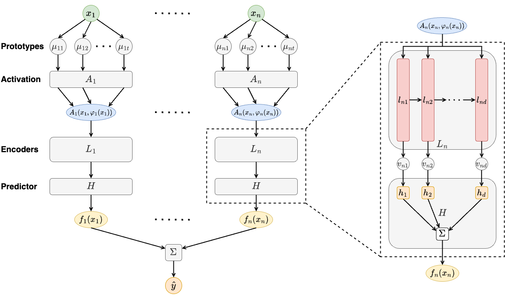
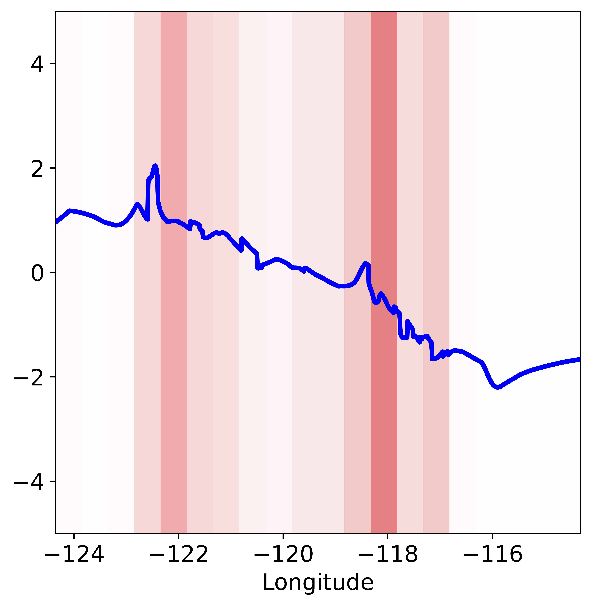
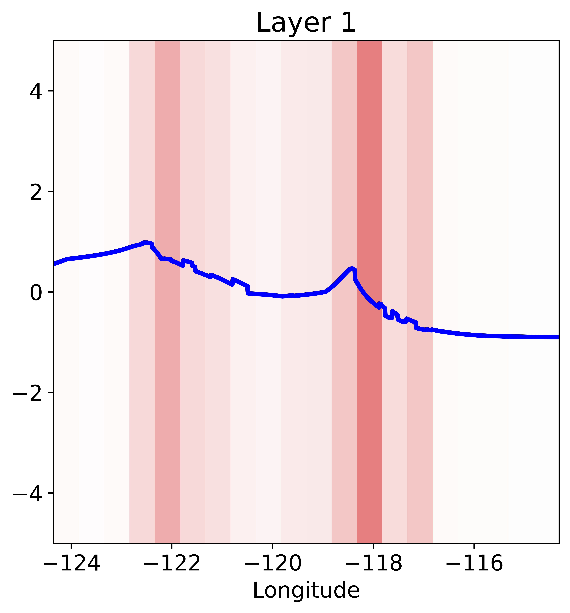
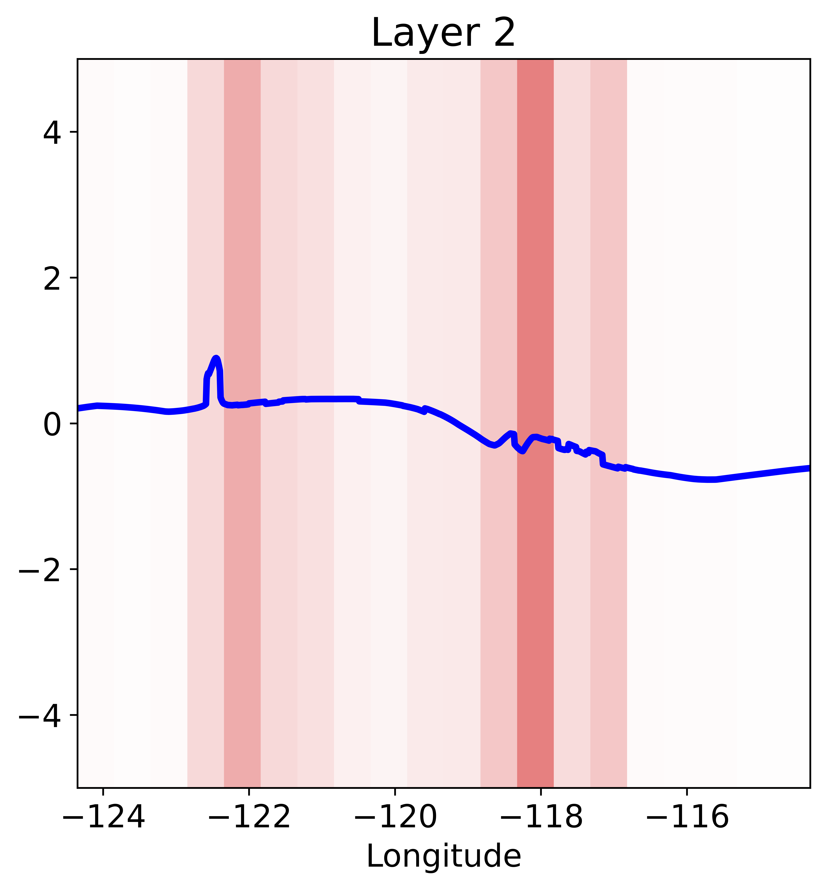
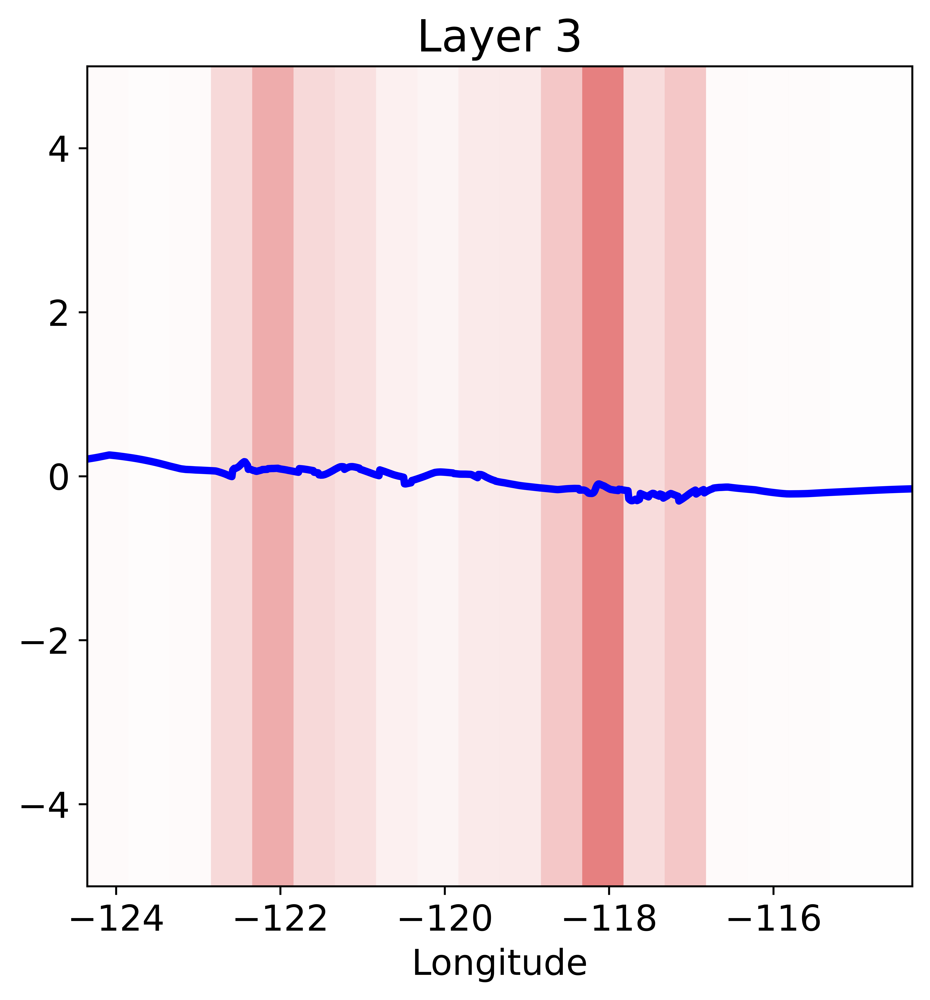
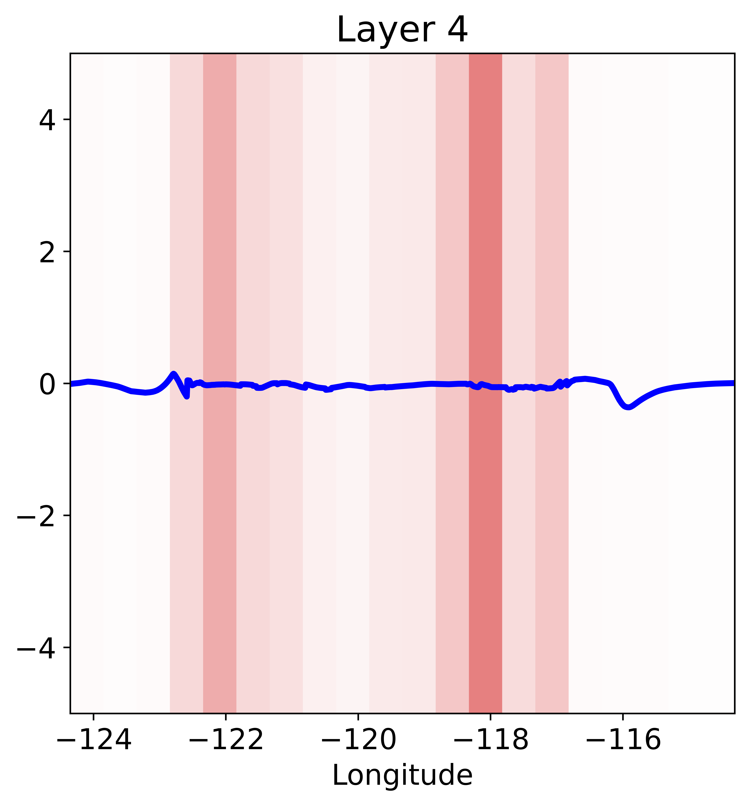

# ProtoNAM: Prototypical Neural Additive Models for Interpretable Deep Tabular Learning

ProtoNAM is a new deep tabular learning method, which introduces prototypes into neural networks in the framework of generalized additive models (GAMs). With the introduced prototype-based feature activation and hierarchical shape function modeling, ProtoNAM can flexibly model the irregular mapping from tabular features to the model predictions, with additional insights (layer-wise explanations) into learned shape functions.

[](https://arxiv.org/abs/2410.04723)

## Table of Contents

- [Introduction](#introduction)
- [Requirements](#requirements)
- [Usage](#usage)
- [Interpretation](#interpretation)
- [Citation](#citation)

## Introduction

The following figure shows the architecture of ProtoNAM. Circles/ovals represent scalar values and rounded rectangles represent functions.



## Requirements

Please install the required packages using: `pip install -r requirements.txt`.

## Usage

### Running ProtoNAM on existing datasets in our paper

The running scripts are included in the `./scripts` directory. Here we give an example of running ProtoNAM on the Housing dataset

```script
seed=0

python src/run.py \
    --data housing \
    --model ProtoNAM \
    --lr 2e-4 \
    --max_epoch 1000 \
    --batch_size 2048 \
    --exp_str 'Optimal_'$seed \
    --device cuda:0 \
    --n_layers 4 \
    --h_dim 64 \
    --n_proto 32 \
    --dropout 0.0 \
    --dropout_output 0.0 \
    --weight_decay 1e-3 \
    --seed $seed \
    --tau 16 \
    --output_penalty 1e-3
```

For this demo experiment:
- the log file is saved at `./log/housing/ProtoNAM/Optimal_0`
- the checkpoint file is saved at `./checkpoint/housing/ProtoNAM/Optimal_0`

### Running ProtoNAM on new datasets

To run ProtoNAM on new datasets, please follow the instructions below to add the dataset information.
1. In `src/load_data.py`, add the function definition to load the new dataset. The function should return a dictionary with the following keys:
    - problem: a string selected from {'regression', 'classification'}
    - X_train: a dataframe for the features in the training set
    - y_train: an array for the labels in the training set
    - X_val: (optional) a dataframe for the features in the validation set
    - y_val: (optional) an array for the labels in the validation set
    - X_test: a dataframe for the features in the test set
    - y_test: an array for the labels in the test set
    - cat_features: (optional) a list of strings for the column names of the categorical features
2. In `src/config.py`, add the corresponding codes in the `__init__` function to allow the loading of the new dataset. The code can be similar to the existing ones in the file:
    - ```python
        >>> if data.lower() == "mimic2":
        >>>     dataset = load_mimic2(fold=fold)
        >>> elif data.lower() == "mimic3":
        >>>     dataset = load_mimic3(fold=fold)
        >>> elif data.lower() == "income":
        >>>     dataset = load_income(fold=fold)
        >>> elif data.lower() == "housing":
        >>>     dataset = load_housing()
        >>> elif data.lower() == NEW_DATASET_NAME.lower():
        >>>     dataset = NEW_DATASET_LOADING_FUNC(**ARGS)
        >>> else:
        >>>     raise ValueError("Data {:s} not supported".format(data))
                    
      ```

## Interpretation
The global and layer-wise visualizations of the shape functions in ProtoNAM can be generated using `src/plot.py` and `src/plot_layer.py`, respectively.

Here we show the commands to generate the interpretation results for the demo experiments presented [above](#usage).

### Global visualization of the learned shape functions in ProtoNAM 

```script
seed=0

python src/plot.py \
    --data housing \
    --model ProtoNAM \
    --lr 2e-4 \
    --max_epoch 1000 \
    --batch_size 2048 \
    --exp_str 'Optimal_'$seed \
    --device cuda:0 \
    --n_layers 4 \
    --h_dim 64 \
    --n_proto 32 \
    --dropout 0.0 \
    --dropout_output 0.0 \
    --weight_decay 1e-3 \
    --seed $seed \
    --tau 16 \
    --output_penalty 1e-3
```

The generated shape plots are saved at `./fig/housing/ProtoNAM/Optimal_0`. The file names are "FeatureName.png". Here we present the visualized shape function for the "Longitude" feature as an example.



### Layer-wise visualization of the learned shape functions in ProtoNAM 

```script
seed=0

python src/plot_layer.py \
    --data housing \
    --model ProtoNAM \
    --lr 2e-4 \
    --max_epoch 1000 \
    --batch_size 2048 \
    --exp_str 'Optimal_'$seed \
    --device cuda:0 \
    --n_layers 4 \
    --h_dim 64 \
    --n_proto 32 \
    --dropout 0.0 \
    --dropout_output 0.0 \
    --weight_decay 1e-3 \
    --seed $seed \
    --tau 16 \
    --output_penalty 1e-3
```

The generated shape plots are also saved at `./fig/housing/ProtoNAM/Optimal_0`. The file names are "FeatureName_LayerIndex.png". Here we present the layer-wise interpretation for the "Longitude" feature as an example.



## Citation
```bibtex
@article{xiong2024protonam,
  title={ProtoNAM: Prototypical Neural Additive Models for Interpretable Deep Tabular Learning},
  author={Xiong, Guangzhi and Sinha, Sanchit and Zhang, Aidong},
  journal={arXiv preprint arXiv:2410.04723},
  year={2024}
}
```